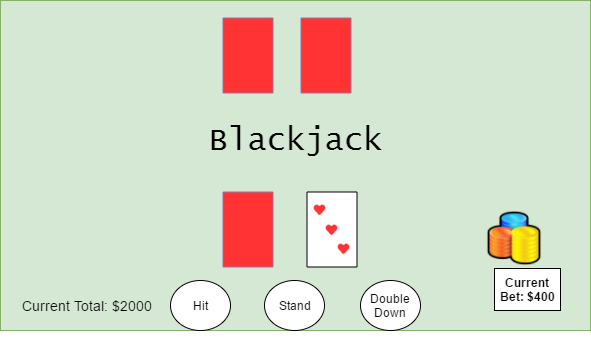

##BlackJack

###Background

Blackjack is a classic card game that, at minimum, requires a player and a dealer.
The rules are as follows
  1) The card values are their values in game, expect for the face cards which are 10, and aces, which are either one or eleven.
  2) If either the player or the dealer busts (going over 21 in count), they lose and the opposing player wins.
    -If the player wins, their bet will be doubled. If the dealer wins, the player's bet is taken
  3) The dealer must stay at 17, unless its a soft 17 (has an ace with a value of one)
  4) 21 is BlackJack and the player with it cannot lose.

### Functionality and MVP

With this BlackJack simulator, users will be able to:
  - [ ] Make bets before the hand is dealt
  - [ ] Hit, stand, or double down on their hand
  - [ ] Cash Out for a high score

In addtion this project will include
  - [ ] A dealer AI that makes intuitive moves

###Wireframes

This app will have one screen showing the player's view of what looks like a real blackjack table. They will be able to see their cards and their current bet.

### Architecture and Technologies

This game will use Javascript for the game logic, Webpack to bundle the files, and Canvas for display and rendering.

There will be an entry file called game-render.js that will take in all of the game logic files and actually run the game with user interaction.

### Implementation Timeline
